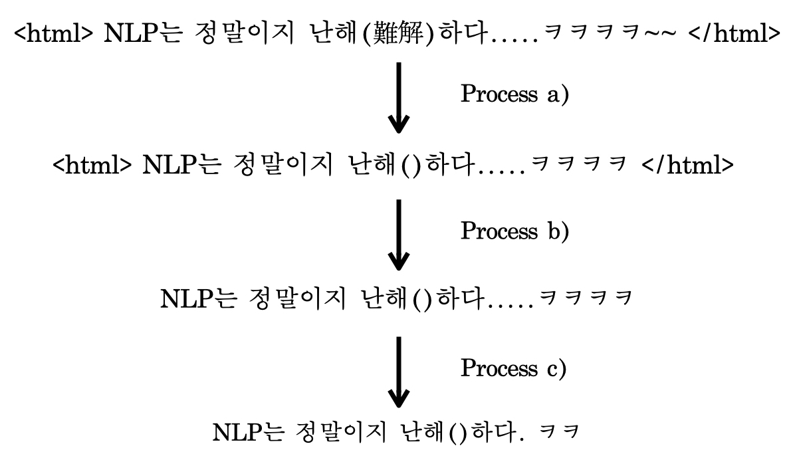
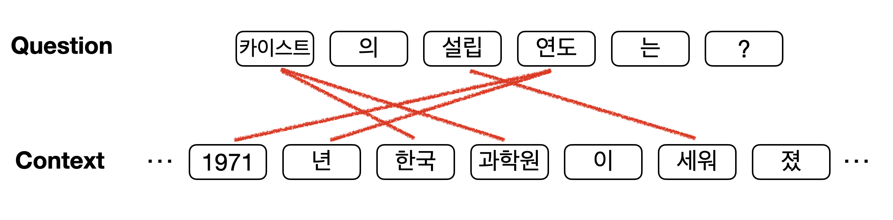
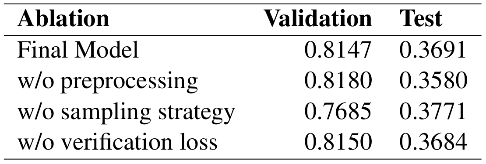
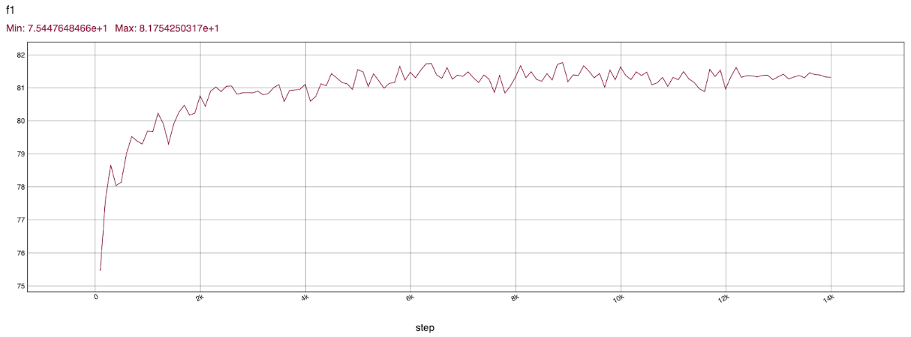
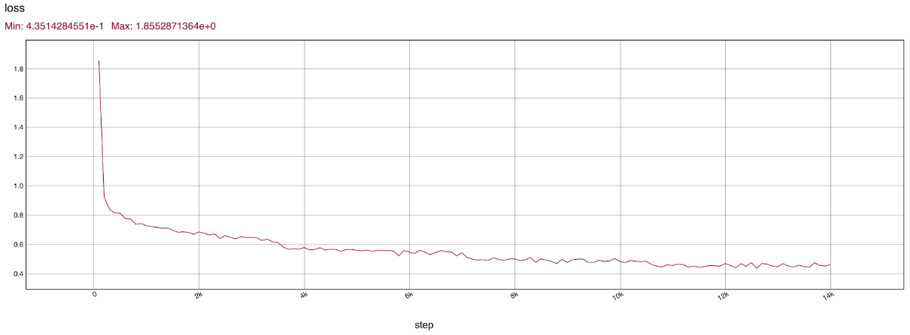

# CS492(I) NLP Project

KAIST CS492(I) Special Topics in Computer Science[Deep Learning for Real-World Problems]

## Original Author
Seonhoon Kim (Naver)

Authorized [DonghwanKim](https://github.com/DonghwanKIM0101)

Authorized [SeungilLee](https://github.com/ChoiIseungil)

-----------

[The final model output](https://drive.google.com/file/d/1k8KLB3umUVo7ink178cfITobQ2F5wRzB/view?usp=sharing)

# Table of contents

1. [Summary](https://github.com/ChoiIseungil/CS492I_NLP/blob/master/README.md#summary)
2. [Method](https://github.com/ChoiIseungil/CS492I_NLP/blob/master/README.md#method)

    2.1 [Preprocessing](https://github.com/ChoiIseungil/CS492I_NLP/blob/master/README.md#preprocessing)

    2.2 [Sampling Strategy](https://github.com/ChoiIseungil/CS492I_NLP/blob/master/README.md#sampling-strategy)
    
    2.3 [Loss Function](https://github.com/ChoiIseungil/CS492I_NLP/blob/master/README.md#loss-function)

3. [Result](https://github.com/ChoiIseungil/CS492I_NLP/blob/master/README.md#result)
4. [Conclusion](https://github.com/ChoiIseungil/CS492I_NLP/blob/master/README.md#conclusion)
5. [Reference](https://github.com/ChoiIseungil/CS492I_NLP/blob/master/README.md#reference)

# Summary

It is project in KAIST CS492(I) course. With NSML of NAVER, implement Korean SQuAD v2.0 model.

SQuAD is one of the important NLP processes that predict answers from question and passage pairs, and SQuAD v2.0 covers answerable questions and unanswerable ones.

Our team's approaches are preprocessing, sampling strategy, and loss function with verification loss. 

# Method

## Preprocessing

Korean SQuAD dataset we use is not that clear to be used for training. Therefore, we perform three steps of text preprocessing to refine the raw dataset. First, characters other than Korean, English, numbers, and a few allowed special characters are all erased. Second, we delete texts in brackets that seems unnecessary. Third, repeated characters are truncated.

</img> 

## Sampling Strategy

We have to select train datasets among a lot of paragraphs. Not only the number of selected contexts but how to select the paragraphs is also important. We suppose that a context which is irrelevant to the question would hinder the training, so we take a strategy to select a context with high similarity with the question.

</img> 

## Loss Function

We suggest our own loss function which is the sum of span prediction loss and verification loss. By doing so, the model is trained by where the answer is and whether the question is answerable or not.

# Result

To check how important the components of our approach are, we perform ablation study to preprocessing, sampling strategy, and loss function. As you can see in the table, we conclude that the most prominent component is preprocessing. Sampling strategy also improves the validation F1-score, but lower the test F1-score. As we expected, we could see that the larger the batch size and the more we trained, the better our final model performs.

</img> 

Following graphs are f1-score and loss of final model.

</img> 
</img> 

# Conclusion

We wanted to exploit FixMatch to MixMatch; FixMixMatch.
From the result, FixMixMatch does not show good result for non-pretrained model.
We guessed that it is because the strong data augmentation does not work well in non-pretrained model.

</img> 

The graph proves our guess.

However, threshold scheduling improves the result.
Compared to original threshold concept, our new concept focuses more on non-pretrained model.
Also, by testing the models in pretrained option, we can get FixMatch works well in pretrained option but does not in non-pretrained option.

# Reference
Jacob  Devlin,  Ming-Wei  Chang,  Kenton  Lee,  andKristina  Toutanova, BERT:  pre-training  ofdeep bidirectional transformers for language under-standing, CoRR, abs/1810.04805, 2018
Kevin Clark, Minh-Thang Luong, Quoc V. Le, and Christopher D. Manning, ELECTRA: Pre-training Text Encoders as Discriminators Rather Than Generators, 2020
Zhuosheng Zhang, Junjie Yang, Hai Zhao. Retrospective Reader for Machine Reading Comprehension
Matthew Denny and Arthur Spirling, Text pre-processing  for  unsupervised  learning:  Why  it  mat-ters, when it misleads, and what to do about it, 2017
Alper Kursat Uysal and Serkan Gunal, The im-pact of preprocessing on text classification.Informa-tion Processing Management, 50(1):104 – 112, 2014.
